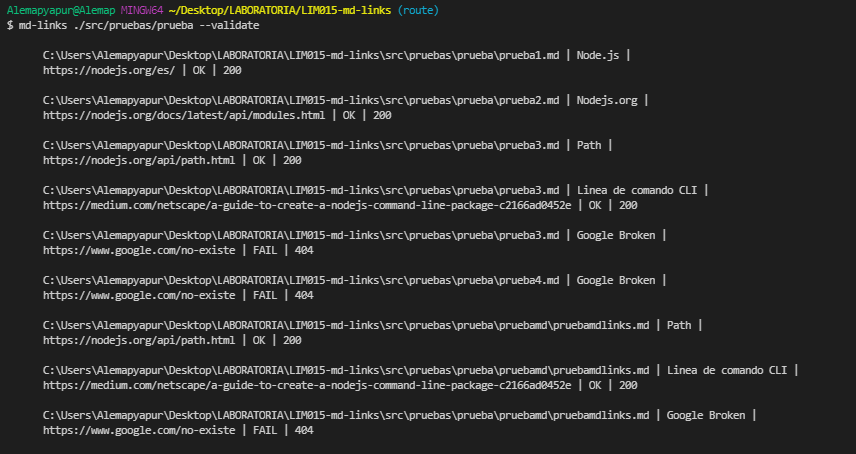
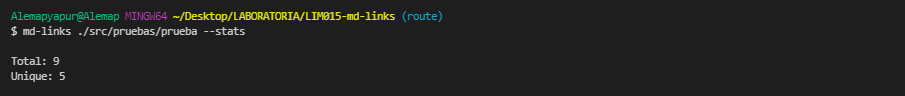
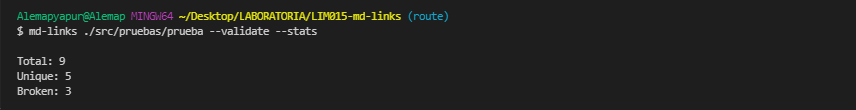
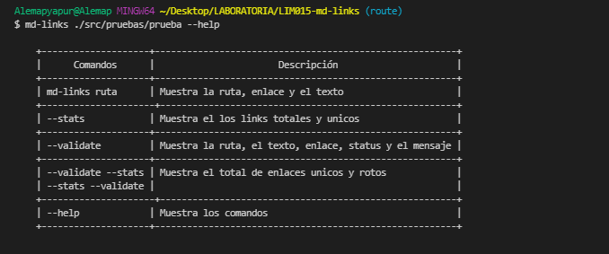

# Markdown Links  &nbsp; 

## Índice

- [1. Resumen del proyecto](#1-resumen-del-proyecto)
- [2. Guia de uso](#2-guia-de-uso)
- [3. Consideraciones generales](#3-consideraciones-generales)
- [4. Pruebas unitarias](#4-pruebas-unitarias)

---

## 1. Resumen del proyecto

Esta es una libreria de NodeJS que contiene un extractor de links, recibe una ruta de archivo en formato “.md” `Markdown` y retorna por medio de la consola un listado de todos los enlaces que contiene el proyecto, así como la línea del archivo donde se encuentra alojado. Además si se añade la opción de `validate` puede comprobar la ruta, el texto y enlace; si pone la opción `stats` puede comprobar que los enlaces están funcionando o de lo contrario están “rotos”.

## 2. Guia de uso

### 📌 Instalación de la librería

Para instalar esta librería debes ejecutar la siguiente linea de comando: `npm i md-links-alemapyapur`.
Este módulo incluye un ejecutable como una interfaz que se puede importar con require:
`const mdLinks = require('md-links-alemapyapur')`;

## 3. Consideraciones generales

### 📌 Diagrama de flujos

#### [📎 MD-LINKS](https://raw.githubusercontent.com/Alemapyapur/LIM015-md-links/route/src/img/mdLinks-flowcharts.png)
#### [📎 CLI](https://raw.githubusercontent.com/Alemapyapur/LIM015-md-links/route/src/img/flowcharts-cli.jpg)

### 📌 Valor de retorno

La función **retorna una promesa** (`Promise`) que **resuelva a un arreglo**
(`Array`) de objetos (`Object`), donde cada objeto representa un link y contiene
las siguientes propiedades

Con `validate:false` :

- `href`: URL encontrada.
- `text`: Texto que aparecía dentro del link (`<a>`).
- `file`: Ruta del archivo donde se encontró el link.

Con `validate:true` :

- `href`: URL encontrada.
- `text`: Texto que aparecía dentro del link (`<a>`).
- `file`: Ruta del archivo donde se encontró el link.
- `status`: Código de respuesta HTTP.
- `ok`: Mensaje `fail` en caso de fallo u `ok` en caso de éxito.


#### `mdLinks(path, options)`

### 📌 CLI (Command Line Interface - Interfaz de Línea de Comando)

El ejecutable de nuestra aplicación debe poder ejecutarse de la siguiente
manera a través de la **terminal**:

`md-links <path-to-file> [options]`

Por ejemplo:

```sh
$ md-links ./some/example.md
./some/example.md http://algo.com/2/3/ Link a algo
./some/example.md https://otra-cosa.net/algun-doc.html algún doc
./some/example.md http://google.com/ Google
```

El comportamiento por defecto no debe validar si las URLs responden ok o no,
solo debe identificar el archivo markdown (a partir de la ruta que recibe como
argumento), analizar el archivo Markdown e imprimir los links que vaya
encontrando, junto con la ruta del archivo donde aparece y el texto
que hay dentro del link (truncado a 50 caracteres).

### 📌 Options

#### Tabla de comandos

    +--------------------+--------------------------------------------------------+
    |      Comandos      |                       Descripción                      |
    +--------------------+--------------------------------------------------------+
    |  md-links ruta     | Muestra la ruta, enlace y el texto                     |
    +---------------------+-------------------------------------------------------+
    | --stats            | Muestra el los links totales y unicos                  |
    +--------------------+--------------------------------------------------------+
    | --validate         | Muestra la ruta, el texto, enlace, status y el mensaje |
    +--------------------+--------------------------------------------------------+
    | --validate --stats | Muestra el total de enlaces unicos y rotos             |
    | --stats --validate |                                                        |
    +---------------------+-------------------------------------------------------+
    | --help             | Muestra los comandos                                   |
    +--------------------+--------------------------------------------------------+

#### Ejemplos de los comandos

📝 `--validate`

Si pasamos la opción `--validate`, el módulo debe hacer una petición HTTP para
averiguar si el link funciona o no. Si el link resulta en una redirección a una
URL que responde ok, entonces consideraremos el link como ok.

Por ejemplo:

```sh
$ md-links ./some/example.md --validate
./some/example.md http://algo.com/2/3/ ok 200 Link a algo
./some/example.md https://otra-cosa.net/algun-doc.html fail 404 algún doc
./some/example.md http://google.com/ ok 301 Google
```

Lo que se obtiene:



📝 `--stats`

Si pasamos la opción `--stats` el output (salida) será un texto con estadísticas
básicas sobre los links.

Por ejemplo:

```sh
$ md-links ./some/example.md --stats
Total: 3
Unique: 3
```
Lo que se obtiene:


📝 `--stats` y `--validate`

También podemos combinar `--stats` y `--validate` para obtener estadísticas que necesiten de los resultados de la validación.

Por ejemplo:

```sh
$ md-links ./some/example.md --stats --validate
Total: 3
Unique: 3
Broken: 1
```
Lo que se obtiene:


También podemos combinar `--validate` y `--stats` para obtener estadísticas que necesiten de los resultados de la validación.

Por ejemplo:

```sh
$ md-links ./some/example.md --validate --stats
Total: 3
Unique: 3
Broken: 1
```
Lo que se obtiene:


📝 `--help`

Si pasamos la opción `--help` el output (salida) será un cuadro con los comandos disponibles.
Lo que se obtiene:



## 4. Pruebas unitarias

- Las pruebas unitarias dan una cobertura del 80% de statements (sentencias), functions (funciones), lines (líneas), y branches (ramas).
Lo que se obtiene:

```
 PASS  src/test/api.spec.js


---------------------|---------|----------|---------|---------|-------------------
File                 | % Stmts | % Branch | % Funcs | % Lines | Uncovered Line #s 
---------------------|---------|----------|---------|---------|-------------------
All files            |   97.67 |       90 |   96.43 |   97.26 | 
 api.js              |   98.53 |    92.86 |      96 |   98.18 | 164
 function-mdlinks.js |   94.44 |    83.33 |     100 |   94.44 | 11
---------------------|---------|----------|---------|---------|-------------------
Test Suites: 1 passed, 1 total
Tests:       39 passed, 39 total
Snapshots:   0 total
Time:        4.48 s, estimated 5 s
Ran all test suites.

```
